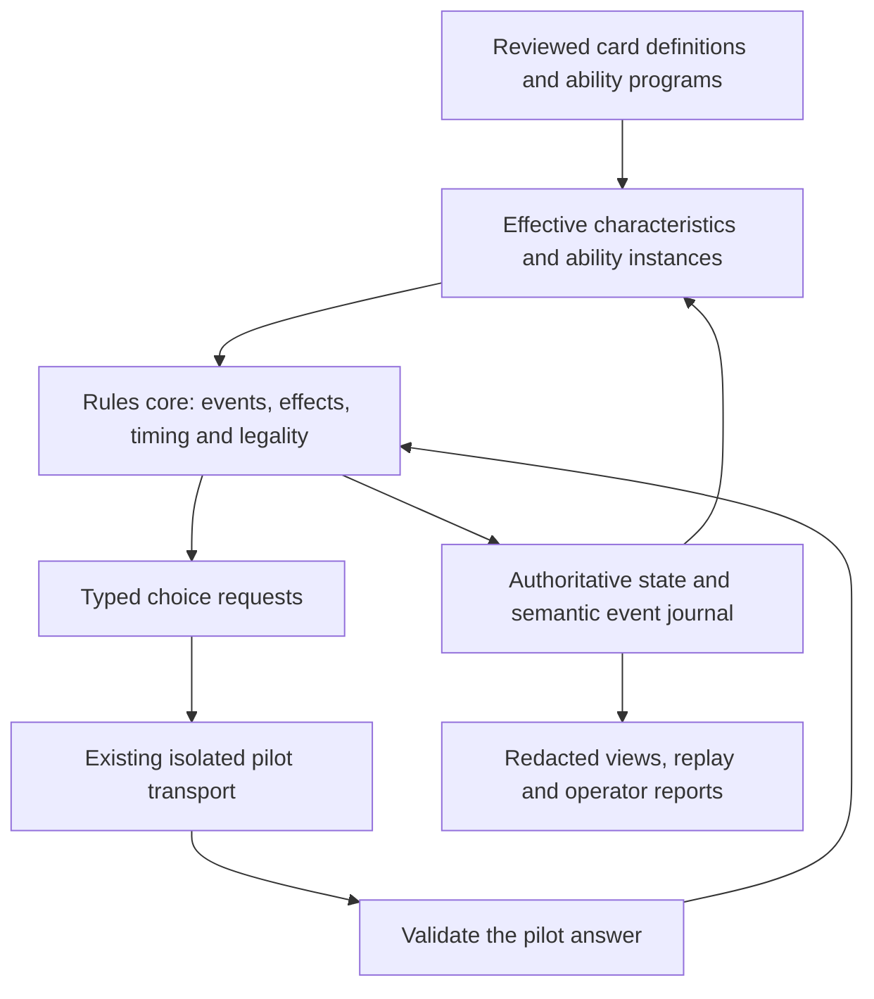

# Rules primitives migration plan

Status: implementation started; see [progress and remaining gates](RULES_PRIMITIVES_PROGRESS.md). This plan is grounded in the repository as inspected on 2026-09-09. This document does not change a running game, its rules contract, or pilot scheduling.

## 1. Outcome and scope

Make the engine responsible for the mechanics of Magic, and make card definitions responsible for composing those mechanics. Adding another “when this enters, return target creature” card should require a definition and a scenario, with no new execution branch in `referee.py`.

The first release targets the four current decks and their interactions, including copied abilities, tokens, granted abilities, and transformed faces. It does not promise arbitrary-card support or automatic translation of arbitrary Oracle text. The architecture must accommodate further mechanics without forcing them into unsafe approximations.

Success means the recent Body Double/Uro, Starfield, reanimation-Aura, and Remand failures become violations of shared contracts, caught by generic tests. Batched choices should emerge from typed choice definitions, rather than another pass through individual handlers looking for loops.

## 2. What exists today

The inspected checkout contains 334 catalog definitions and 728 ability records: 531 marked `oracle_only`, 118 `generic`, and 79 `registered`. All 79 registered action abilities refer to `legacy:` handlers. There are also 49 entry-replacement records. These are inventory labels, **not measured execution coverage**: Oracle and registry records overlap, and an Oracle-only clause may have an implementation elsewhere.

`engine.py` is about 3,345 lines and `referee.py` about 8,971. Existing foundations worth retaining:

| Component | Reuse | Missing authority |
| --- | --- | --- |
| `catalog.py`, generated card catalog | Stable definitions, faces, ability IDs, deck occurrences | Executable, validated ability programs with explicit coverage |
| `ability_registry.py` | Catalog-backed action inventory | Currently projects legacy handler names |
| `rule_events.py` | Typed events, source records, discovery/building boundary | Referee initializes an empty builder registry; inspected discovery path audits legacy execution |
| `continuous.py` | Layer ordering and scoped read-only caches | Effects are still assembled by card-specific referee code; dependency semantics need expansion |
| `decision_selection.py`, selection helpers | Shared cardinality/group checks and ordered answers | A general target/choice schema and compiler; selections are still wired into handlers |
| Combat and approved-sequence modules | Structured answers, exact pilot authorization | Shared identities, target predicates, costs and effect execution |
| Campaign, quarantine and host recovery | Bound decisions, evidence, explicit repair workflow | A pinned rules implementation and safe migration protocol for the new core |

The old 1,030-test suite described in `VALIDATION.md` was removed by prior operator instruction. Its historical pass is useful evidence, not executable coverage available for this migration. Retain the current regression tests and create a durable rules conformance suite; recovering older fixtures, if available and useful, is a separate task.

## 3. Architectural boundaries



Keep current public module/CLI paths stable. Introduce focused modules within `edh_gauntlet`, consistent with `PROJECT_LAYOUT.md`; initially `ManualGame` is the compatibility facade. Host, planner, diplomat and dashboard code consume outputs, not card mechanics.

Three distinct authorities:

1. **Rules core:** what happens, what is legal, when choices are required, and when priority occurs.
2. **Card program:** which supported mechanics this ability uses, with parameters and explicit exceptions.
3. **Pilot:** all material choices, targets, ordering, optional actions and strategy. The core never substitutes its preferred answer.

An AI may draft definitions or audit behavior offline. Reviewed programs execute deterministically. Runtime Oracle interpretation and speculative winner estimates do not authorize state changes.

## 4. Primitive contracts

### A. Identity and authoritative state — first priority

Introduce `CardId` for the persistent physical card and `ObjectRef(CardId, incarnation)` for the current game object. Keep ownership, control, printed identity, effective characteristics, and command-zone designation separate. Copies and tokens have explicit identities. A control change or phasing operation must not be confused with an ordinary zone change.

Maintain one authoritative location index, including the stack. Player zone lists become indexed views, not independently writable stores. Track out-of-game objects after elimination for conservation checks without leaving them in active play. A zone transition determines when to allocate an incarnation, with explicit support for rules exceptions.

Add typed references for source-at-trigger-time, last-known information, the enchanted object, objects returned by an effect, and linked exiled objects. A rule saying “this object” binds to its ability instance; it must not search for a matching card name.

Exit criteria: one physical card cannot simultaneously occupy hand and command zone; a stale battlefield target cannot refer to a returned incarnation; a source leaving does not erase its already-created stack ability.

### B. State changes and semantic events

Only the core mutates authoritative game state. Introduce operations such as:

- `MoveObjects`, with destination, affected owner/controller, cause and simultaneous group.
- `PutOntoBattlefield`, `Attach`, `Detach`, `ChangeControl`, `PhaseOut`, `PhaseIn`.
- `DrawCards`, `DiscardCards`, `SearchZone`, `Reveal`, `Shuffle`, `CreateTokens`.
- `AddCounters`, `RemoveCounters`, `MoveCounters`, `ChangeLife`, `DealDamage`.
- `Tap`, `Untap`, `AddMana`, and explicit duration/permission changes.

These are distinct semantic operations, even where they share lower-level storage changes. Sacrifice, destroy and a direct move to the graveyard must not be treated as interchangeable. Damage is not merely loss of life; moving counters is not an arbitrary remove/add sequence that loses its rules semantics.

A mutation produces a typed event with cause, source, affected objects, before/after information, replacement trace and visibility. Render prose afterward. Triggers subscribe to semantic events, never English log text. Existing logs remain a presentation adapter.

Simultaneous changes share a batch and appropriate pre/post snapshots. Within a resolving instruction, follow actual sequencing; do not run state-based actions after every individual primitive merely because it is convenient. Effects generated during resolution wait for the appropriate boundary.

### C. Replacement and prevention effects

Represent a proposed event before committing it. Eligible effects can modify, prevent, or replace that proposal. Recompute applicability as required, track which effects have applied to that event, and ask the rules-designated chooser when an ordering choice exists. Do not assume every choice belongs to the active player or source controller.

Begin with commander destination handling, enters-tapped/enters-with-counters/copy-as-entry behavior, counter changes, graveyard replacement, and damage prevention. Add explicit handling for self-replacement and competing effects as demanded by the supported cards.

Commander destination selection and physical movement should have one owner. Neither the counterspell nor the outer cast finalizer gets to move a card a second time. Tax derives from actual command-zone casts; it is independent of the destination chosen after a counterspell.

### D. Effective characteristics and ability instances

An effective-characteristics service supplies the same answer to targeting, combat, trigger discovery, state-based actions and presentation. Extend the existing layer evaluator instead of introducing another collection of type/power helpers.

Separate copiable values from counters, attachments, temporary effects and action history. Instantiate copied/granted abilities on their actual current object. Body Double copying Uro consequently acquires Uro's abilities while retaining Body Double's physical identity; escape status comes from how that object entered, not from the copied definition.

Implement dependencies, timestamps, applicable layer substructure, characteristic-defining abilities and ability removal through structured effects. Explicitly test dependency cycles and cross-effect interactions. Rule-changing effects belong to a separate evaluated rules/permissions service, not a fictional eighth characteristics layer.

Do not attempt all layer interactions before the first milestone: identity plus a minimal copy/ability view can precede the complete continuous-effects migration. Keep that supported subset explicit.

### E. Triggers, stack and timing

An `AbilityInstance` binds definition, source incarnation, controller, source characteristics and link context. A `TriggerSpec` describes its event predicate, conditions, choices, targets and effect program.

Separate:

- Eligibility when an event occurs.
- Conditions checked again on resolution where required.
- A condition inside the resolving effect.
- Optional instructions within an otherwise real trigger.

This prevents Uro's sacrifice condition from being mistaken for a condition that suppresses the trigger, or Starfield's optional return from suppressing required target selection.

Use one pending-trigger collection and one priority/state-based-action driver. It handles simultaneous-event observations, last-known information, APNAP placement, each controller's ordering, delayed/reflexive triggers, state-based actions until stable, and the next legal priority boundary. Trigger instances have stable IDs and causality; deduplication must not collapse legitimately identical triggers.

Represent stack work as data with a serializable execution frame: program counter, chosen modes/targets, local bindings and pending choice. Gradually replace resolver closures. This supports exact suspension/replay without relying on Python object identity or rebuilding ambiguous local variables.

### F. Choices and targeting — general batching

Introduce `ChoiceSpec` with actor, information visibility, timing, set/ordered-set/allocation/partition shape, bounds, optionality, and dependencies. `TargetSpec` additionally describes target groups, zones, predicates, source relationship and target legality.

A single choice compiler generates the menu, structured input schema, validator, stable references and human-readable explanation. Both direct submissions and approved sequences use that validator.

Represent “up to three noncreatures,” “one nonland per opponent,” “five distinct graveyard cards,” and “divide N among selected targets” as constraints. Distinctness is local to the relevant target/choice groups: do not impose a universal ban on reusing one object across separate target clauses where the rules allow it.

Batch choices only when the schema establishes the same chooser, compatible timing and no intervening revelation, priority, state change or dependency. Ordered input preserves order. Allocation includes amount constraints and the timing at which amounts become fixed. Multi-player choices preserve APNAP and information restrictions, even when the resulting action is simultaneous.

Validate targets at announcement and recheck the required legality on resolution, including object incarnation, current characteristics, source-specific protection, shroud/hexproof and phased status. Distinguish targets from nontarget choices; proliferate is a useful first example. Handle partially illegal targets and entirely illegal targeted objects through the common resolution rule.

Use compact option records and constraint groups, never enumerate every subset, permutation, target combination or allocation. Dependent choices stay staged; the batch compiler must not execute effects speculatively to learn the next answer.

### G. Costs, casting and activation

Represent mana, tap/untap, sacrifice, discard, exile, life, counter and return costs using `CostSpec`. A shared announcement protocol handles modes, X, targets, alternative/additional costs, permissions, restrictions, cost modifications and payment.

Validate the whole declaration at its appropriate stages and commit costs with correct event semantics. Mana abilities and triggers generated while paying require explicit timing; “atomic” storage must not suppress those rules. A dry-run legality query cannot mutate state or decide replacement choices. Suspend for a necessary choice and retain the announcement frame.

Reduce `cast`, registered activations and special cost handlers to adapters into this protocol. Preserve distinctions between mana abilities, special actions and stack-using abilities.

### H. Attachments, linked abilities and durations

Use explicit attachment relations with enchant/equip legality, plus the appropriate state-based checks. Noncast Aura entry and Aura spells take their respective paths through shared rules. Linked abilities use typed link identities, not a card-name lookup or one global “last exiled” slot.

Duration records cover until-source-leaves, until-end-of-turn, delayed next-boundary effects and control-dependent conditions. An old incarnation leaving cannot terminate or satisfy a new incarnation's unrelated link.

Migrate Animate Dead/Dance of the Dead, Necromancy, Felidar Guardian, Parallax Wave, Oblivion Ring and Grasp of Fate together as an interaction family, after the basic zone/trigger contracts work.

### I. Combat, counters, tokens and shortcuts

Integrate existing blocker and damage declarations into the shared identity, characteristics, restriction and damage services. Preserve attack destinations, removal from combat, first/double strike, trample, damage prevention, lifelink, deathtouch and commander damage through their own rules.

Use a common counter representation for objects and players; energy is not the only player counter type the architecture should support. Implement proliferate as a choice plus the appropriate counter operation and replacements. No card loop selects recipients automatically.

Remove silent numerical caps on game effects. Large operations need exact chunking, proven equivalent compression, or an explicit supported limit that stops execution. A watchdog is a diagnostic, not a different game result.

Keep combo shortcuts outside basic legality. A shortcut proposal must identify a legal repeatable sequence, finite iteration count or other authorized stopping description, state transformation and interruption opportunities. Test the unsummarized sequence first. No name-based “combo present, therefore win” predicate may become the rules authority. Continue using existing explicit adjudication boundaries until this work is ready.

## 5. How card definitions should look

Prefer typed Python constructors for initial authoring, validated and serializable to a closed intermediate representation. Arbitrary JSON expressions and `eval` are unnecessary. The card program is data; generic interpreters implement its operations.

Illustrative notation only, not a proposed literal Oracle parser:

```python
Ability(
    id="starfield.upkeep_return",
    trigger=AtStepBeginning("upkeep", active_player=Controller()),
    targets=TargetGroup("card", count=Exactly(1),
                        zone=GraveyardOf(Controller()), predicate=IsEnchantment()),
    effect=May(Controller(), PutOntoBattlefield(Target("card"))),
)

Ability(
    id="uro.sacrifice",
    trigger=EntersBattlefield(Self()),
    effect=If(Not(EntryHistory(Self()).escaped), Sacrifice(Self())),
)

Ability(
    id="evolution_sage.landfall",
    trigger=EntersBattlefield(IsLandControlledBy(Controller())),
    effect=Proliferate(Controller()),
)
```

The trigger engine handles an unplaceable required-target trigger; the definition does not implement a bespoke snooze/pass workaround. Uro's separate value ability is another program and is copied independently along with the sacrifice ability.

A card's definition may contain literal costs, quantities, predicates, timing, link keys, copy exceptions and a unique composition. It may not directly mutate zones, dispatch its own priority loop, inspect pilot strategy, or decide target order. An exceptional mechanic requires a named extension with declared inputs, reads/writes, timing and tests. It cannot call an unrestricted `legacy_handler(card_name)` inside an otherwise “migrated” program.

## 6. Coverage accounting and enforcement

Build an ability-level support manifest joining Oracle clauses, registry abilities, entry replacements, faces, granted abilities and actual execution paths. Resolve duplicate inventory records before reporting coverage.

Every clause is classified as `primitive`, `legacy_adapter`, `explicit_extension`, `unsupported`, or `non_executable_text`, with evidence and tests. A claim of primitive support includes dependencies: a generic trigger with a bespoke effect body is still partly legacy.

Make the compiler reject unknown nodes, dangling references, illegal stage dependencies, unresolved handlers and inconsistent target/cost schemas. Unsupported static/replacement behavior must be caught when it can affect the board, not only after a pilot chooses an action. A coverage scan must account for copied and generated objects.

For migrated regions, add architectural checks prohibiting direct zone-list writes, duplicate card-name dispatch, strategy imports, arbitrary RNG, direct host calls and rules changes in presentation code. Keep a shrinking, reviewed allowlist around legacy boundaries. Measuring fewer card-name comparisons alone is insufficient: moving the same branches into another file does not count as migration.

## 7. Test strategy and proof obligations

Use deterministic, authored scenario answers for tests. Test pilots do not need live AI inference. Each primitive has contract tests; interaction scenarios prove composition.

| Regression family | Required assertions |
| --- | --- |
| Remand and commander movement | Owner chooses destination; exactly one physical location; command-zone cast count/tax correct; cast cleanup cannot move it again |
| Body Double copies Uro | Both abilities appear on actual entrant; self-reference works; escape history is not copied; blink creates a new object |
| Starfield upkeep | Trigger timing and required target selection survive a sleeping pilot; optional return occurs at resolution; stale graveyard object is not returned |
| Reanimation Aura + Felidar | Correct entry attachment, link and leaving trigger; sacrifice timing survives source removal; no invented immediate loop |
| Simultaneous entry/death | Correct observers and last-known information; no missing or doubled triggers; controller ordering and priority preserved |
| Multi-target and multi-choice | Group bounds, same-name distinct objects, allowed target reuse, ordering, allocations, partial illegality and equivalent legal answer channels |
| Counters and layers | Copy versus counters, ability gain/loss, control changes, counter replacements and player counters; zero/negative relevant boundaries |
| Costs and interruption | Failed declarations do not leave partial payments; paid costs stay paid after countering; cost-generated triggers obey timing |
| Large effects and loops | Exact quantities; no silent clamps; bounded diagnostic stop is distinguishable from a draw or win |
| Privacy and recovery | A hidden-zone search does not disclose unrelated order; checkpoint/resume delivers one accepted action exactly once |

Add property/state-machine tests for zone conservation, incarnation freshness, attachment integrity, legal stack references, deterministic RNG and idempotent retry. Check invariants at valid semantic boundaries; a spell on the stack must count toward physical ownership, and transient legal states must not be rejected prematurely.

Add metamorphic tests: rename an otherwise identical fixture; copy an ability onto a different printed card; change the seat controlling the same source; replay with different Python allocation identities; serialize/resume mid-choice. These specifically expose dependence on card names, seat names and object identity.

Differential tests compare old/new behavior only for verified-correct scenarios. Compare semantic state, target bindings, pending choices, trigger counts, priority boundaries and event causes—not merely final winner or raw log text. Known-bug fixtures must match independently reviewed expectations, with expected differences documented. Never make the old engine the sole truth oracle.

Track coverage by interaction matrix, not raw test count. Mutation tests should demonstrate that removing trigger discovery, bypassing replacement selection, or weakening incarnation checks makes tests fail.

## 8. Migration and replay safety

Start by preserving a reproducible legacy runtime: source/catalog snapshots and hashes including uncommitted code, dependency/environment information, RNG behavior and rules-reference version. A Git commit alone cannot describe this currently modified workspace.

Bind new games to a `rules_engine` version, card-program bundle hash, primitive schema version and choice schema version. Preserve existing planning, communications and scheduling contracts independently. Do not retrofit these fields as a claim that old games originally used them.

During development, a per-ability ownership table chooses either the legacy adapter or the new interpreter. Never let both execute the same ability. A migrated effect may touch a legacy card; legacy listeners must receive the same committed semantic event through one bridge, not a second independently inferred event. Move tightly coupled families together where mixed execution cannot be proved safe.

Use three separate compatibility paths:

1. **Existing live/historical games:** their pinned compatible runtime and accepted journals remain authoritative. Repairs still use explicit quarantine/reconciliation and fenced recovery.
2. **Shadow scenarios/replays:** run both implementations in isolated state with recorded authored answers. A changed decision topology produces a classified comparison boundary; never synthesize the missing answer or feed one seat another seat's information.
3. **Fresh validation games:** explicitly opt into the new engine, then advance coverage after each acceptance gate.

Decision identity must bind semantic choice, actor, stage, source incarnation and legal-option schema. A legacy-label adapter can map an equivalent recorded answer only when identity and semantics are proved; retain the original record and a mapping receipt. Changed timing, ownership or information requires a new decision, not index renumbering disguised as compatibility.

Pin the same engine bundle for gameplay, statistics replay and postgame analysis. The recently missed batching flags in `cardwise_replay.py` show why ad hoc constructor argument lists should become one validated runtime configuration constructor.

Rollback means stopping new-engine admission and selecting a previous verified implementation for a fresh game, or performing an explicit stopped-game recovery. It never means replaying already accepted actions, silently moving a game back to the legacy implementation, or rewriting a sealed result. AI winner estimates remain separate observational data.

## 9. Ordered delivery plan

Each stage is a reviewable set of changes with a stop/go gate. Later expansion is contingent on the earlier contracts being demonstrated.

| Stage | Deliverable | Acceptance gate | Relative effort |
| --- | --- | --- | --- |
| 0. Baseline and support inventory | Pinned legacy bundle; clause/handler map; bug fixtures; measured replay/menu baseline | Current games reproduce; unsupported and overlapping coverage is explicit | Small–medium |
| 1. Identity and zone kernel | Location index, incarnations, event proposals, commander/Remand vertical slice | Conservation and destination tests pass; one runtime owns each movement | Large |
| 2. Minimal copy and trigger pipeline | Effective ability instances, pending triggers, typed stack frames; Uro/Body Double/Starfield | All three regression families pass without card-specific trigger dispatch | Large |
| 3. Choice, targeting and announcement | Choice/target/cost schemas; generated batches; shared validation and casting adapters | Generic fixtures plus Grasp/Terastodon/proliferate/escape; no combinatorial menus | Large |
| 4. Replacement, layers, attachments and links | Broader effect ordering; reanimation/blink family; derived-characteristics authority | Cross-family interaction suite passes; no synthetic copied source or stale links | Very large |
| 5. Deck migration and combat integration | Remaining current-deck families; typed tokens/counters/damage; restricted extensions | Every material clause is accounted for; unsupported behavior cannot silently execute | Very large |
| 6. Performance and release | Semantic checkpoints, indexed subscriptions, conformance suite, fresh-game rollout | Correctness gates plus measured performance and recovery gates | Medium–large |

First implementation batch:

1. Add the support inventory and five recent-defect fixtures without changing live execution.
2. Define identities, location index, proposed/committed zone events and their invariants.
3. Implement Remand and commander movement through that vertical slice in an isolated test engine.
4. Add entry history, minimum copy semantics and ability-instance binding.
5. Demonstrate Body Double/Uro and Starfield using definitions plus common trigger execution.

This first batch proves the design before mass-migrating cards or designing every possible primitive. Do not begin by splitting the 9,000-line referee into many equally card-specific files.

## 10. Performance, observability and release criteria

Measure engine time separately from model inference, queue delay and transport. Benchmark legal-menu generation, accepted-decision replay, serialization, event dispatch, derived characteristics, and pause/resume on reproducible late-game fixtures. Capture warm/cold cache conditions and prompt sizes.

Index trigger subscriptions by event kind and relevant characteristic changes. Cache derived views by explicit state revisions and dependencies. Checkpoint serializable rule frames only after correctness is established. Keep full semantic evidence in storage while sending pilots only current relevant state and needed explanations.

Proposed release targets, to validate against the baseline:

- Every material ability/face in the four decks has an explicit support classification and scenario coverage; unsupported clauses stop admission or the affected rules boundary.
- All migrated families pass generic and interaction tests, including the known failures; no unresolved critical differential mismatch.
- Zero unrestricted state writes or legacy dispatch calls in migrated execution paths.
- At least 90% of deduplicated executable ability clauses in the fixed pod compose shared primitives; publish the remaining extension/legacy list. This is a proposed target, not current coverage.
- Independent same-boundary selections use one bounded request; no subset/permutation enumeration and no skipped priority or information boundaries.
- Initial new-core engine-only p95 latency no worse than 20% above the measured legacy baseline; target parity or improvement before default rollout. No correctness concession to meet a latency target.
- A minimum of 100 deterministic complete scenario-game runs across all seats and declared mechanics, plus targeted high-risk interactions, with zero invariant failures or unclassified unsupported effects. This sampling does not certify all Magic interactions.
- Paused/resumed execution and clean replay agree on semantic state and the accepted prefix. Statistics use the same pinned semantics.

Core telemetry should identify the primitive, ability instance, event cause, decision stage and violation category. A rules-state assertion must reach the existing durable quarantine/stop workflow, not only leave a traceback and a misleading generic host-stopped marker. Unsupported semantics, inconsistent state, transport failure and operational time limits need distinct handling under campaign authority.

## 11. Main risks and decisions

**A generic-looking engine that still hides bespoke handlers:** enforce ownership and write barriers; audit composed effect bodies and extension dependencies.

**An overly ambitious language:** start with typed constructors and a small interpreter, adding constructs through real interaction families. Do not build a general-purpose programming language or exhaustive Oracle parser.

**Incorrect timing disguised as batching:** carry semantic stages and information dependencies explicitly. Keep separate actor decisions and replacement choices when required.

**Mixed-runtime double execution:** one authoritative state store and one executor per ability, with a tested event bridge. Stop migration of a family if equivalence is not demonstrated.

**False confidence from replay parity or test totals:** preserve independently reviewed expectations, mutation tests and explicit unsupported coverage. A replay can faithfully reproduce a bug.

**Migration affecting ongoing play:** use isolated fixtures and fresh validation games; keep new core activation explicit. This planning task itself makes documentation changes only.

This is a substantial engine project. Estimate calendar time after stages 0–1 reveal the real clause inventory and adapter burden; stage effort above is a planning guide, not a delivery promise. The first useful outcome is the small identity/zone/trigger vertical slice, not waiting for full deck conversion.

## 12. Reference baseline

Use the [official Wizards rules page](https://magic.wizards.com/en/rules) to pin the rules edition. The linked text inspected for this plan is [the 2026-08-19 download](https://media.wizards.com/2026/downloads/MagicCompRules%2020260819.txt), whose header states an effective date of August 7, 2026. Preserve both retrieval metadata and a content hash; filenames alone are insufficient version identifiers.

Relevant areas for the conformance matrix include objects/zones, targets, timing/priority, costs, casting/activation, triggered and linked abilities, resolution, continuous/replacement/prevention effects, state-based actions, copying, shortcuts and Commander. This document proposes software boundaries; card-specific semantic tests must cite the applicable pinned rules and card text during implementation.

Repository authorities: [catalog architecture](CARD_CATALOG_ARCHITECTURE.md), [project boundaries](PROJECT_LAYOUT.md), [manual referee protocol](MANUAL_REFEREE_PROTOCOL.md), [campaign lifecycle](GAUNTLET_WORKFLOW.md), [validation history](VALIDATION.md), and [host runtime](HOST_RUNTIME.md).
